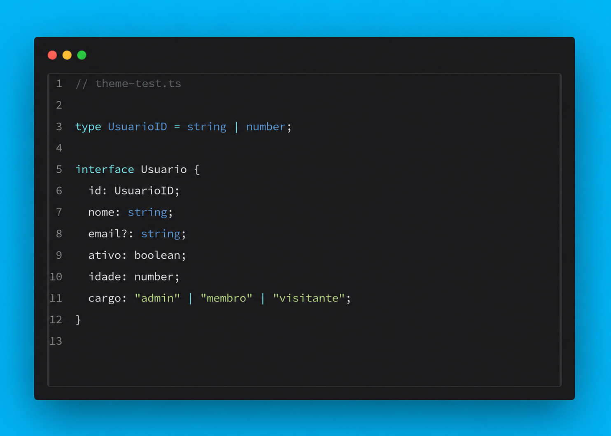
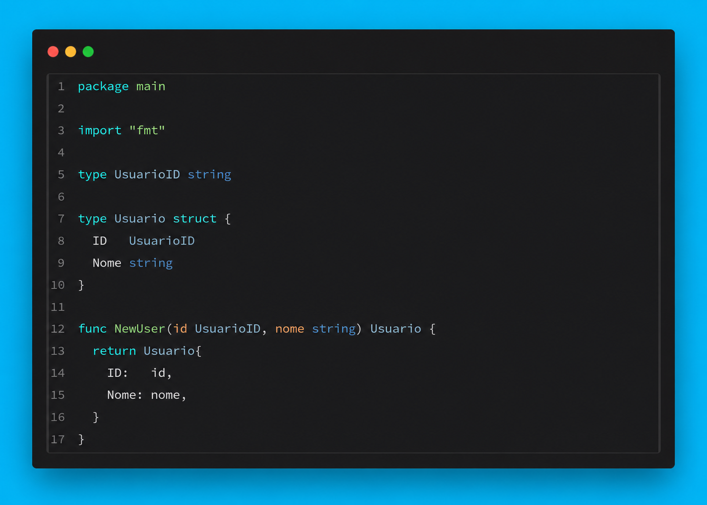

# Lunaris

Minimal VS Code theme with a clean dark palette built to keep focus on the code.

[Install on Marketplace](https://marketplace.visualstudio.com/items?itemName=luas10c.vscode-lunaris-theme)

## Installation

Open `Extensions` in VS Code, search for `Lunaris`, and click `Install`.

## Screenshots

  
  

## License

MIT

